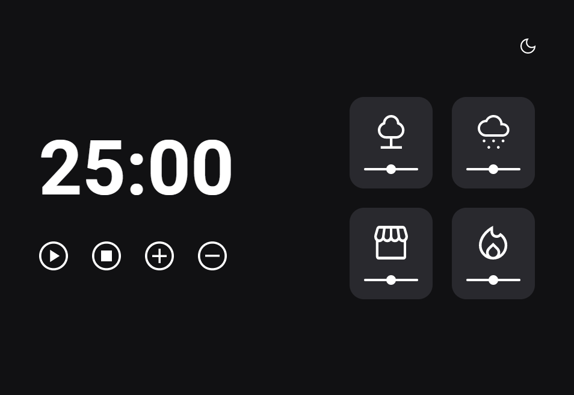

# Explorer (Rocketseat)

> Trilha Explorer

Projeto construido no stage 5 do curso Explorer da Rocketseat

[Clique aqui para acessar](https://projeto-07.vercel.app/)

## Tecnologias

- HTML
- CSS
- Git e Github

## O que aprendi

- Como manipular o navegador utilizando a DOM
- Funções callbacks
- Recursividade
- ES6 Modules
- Display grid
- Cartões e sons

## Contato

beto.balmant@hotmail.com
